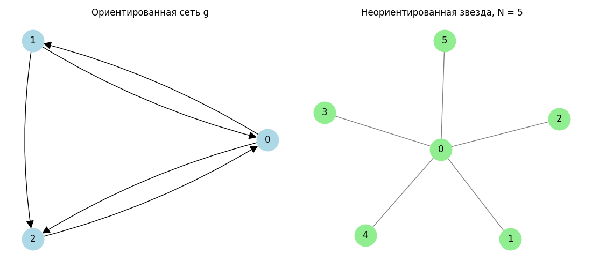
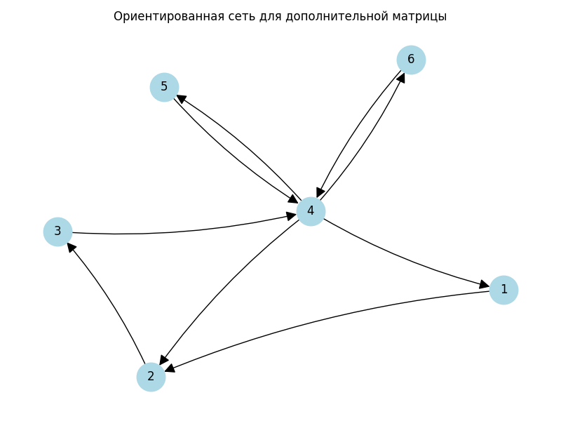

# Задание 2

Расчет центральностей для двух сетей с проверкой через `networkx`:

- ориентированная сеть с матрицей смежности

```text
0 1 1
1 0 1
1 0 0
```

- неориентированная звезда с `N + 1` узлами.

В работе считаются:

- центральность по собственному вектору;
- PageRank при `alpha = 0.25` и `alpha = 0.50`;
- изменение PageRank при увеличении `alpha`;
- центральность Каца при `alpha = 0.50`;
- условие, при каких `N` центральность Каца однозначно определена для звезды.

## Установка

Из корня проекта:

```bash
python3 -m venv .venv
.venv/bin/pip install -r requirements.txt
```

## Запуск

```bash
cd task_2
../.venv/bin/python main.py
```

После запуска создаются файлы:

- `task_2_networks.png` - визуализация ориентированной сети и звезды;
- `output.txt` - сохраненный вывод программы.

## Визуализация



## Краткие выводы

Для ориентированной сети при увеличении `alpha` с `0.25` до `0.50` PageRank узла `0` увеличивается, PageRank узла `1` уменьшается, а значение узла `2` практически не меняется.

Для звезды спектральный радиус равен `sqrt(N)`. Центральность Каца при `alpha = 0.5` корректно определяется при условии `0.5 < 1 / sqrt(N)`, то есть `N < 4`. Для целых положительных `N` это `N = 1, 2, 3`.

## Результаты

```text
Задание 2
Проверка расчетов с помощью NetworkX

A. Ориентированная сеть g
Матрица смежности:
[[0 1 1]
 [1 0 1]
 [1 0 0]]

Центральность по собственному вектору:
узел 0: 0.647936
узел 1: 0.400447
узел 2: 0.647936

PageRank, alpha = 0.25:
узел 0: 0.370370
узел 1: 0.296296
узел 2: 0.333333

PageRank, alpha = 0.50:
узел 0: 0.400000
узел 1: 0.266667
узел 2: 0.333333

Изменение PageRank при увеличении alpha с 0.25 до 0.50:
узел 0: +0.029630
узел 1: -0.029630
узел 2: -0.000000

Центральность Каца, alpha = 0.50:
узел 0: 0.639602
узел 1: 0.426401
узел 2: 0.639602

Б. Неориентированная звезда с N + 1 узлами
Для проверки считаются звезды при N = 1, 2, 3, 4, 5, 6.
Узел 0 - центр звезды, остальные узлы - листья.

N = 1, число узлов = 2, спектральный радиус = sqrt(N) = 1.000000
Центральность по собственному вектору:
узел 0: 0.707107
узел 1: 0.707107
PageRank, alpha = 0.25:
узел 0: 0.500000
узел 1: 0.500000
PageRank, alpha = 0.50:
узел 0: 0.500000
узел 1: 0.500000
Центральность Каца, alpha = 0.50:
узел 0: 0.707107
узел 1: 0.707107

N = 2, число узлов = 3, спектральный радиус = sqrt(N) = 1.414214
Центральность по собственному вектору:
узел 0: 0.707107
узел 1: 0.500000
узел 2: 0.500000
PageRank, alpha = 0.25:
узел 0: 0.400000
узел 1: 0.300000
узел 2: 0.300000
PageRank, alpha = 0.50:
узел 0: 0.444444
узел 1: 0.277778
узел 2: 0.277778
Центральность Каца, alpha = 0.50:
узел 0: 0.685994
узел 1: 0.514496
узел 2: 0.514496

N = 3, число узлов = 4, спектральный радиус = sqrt(N) = 1.732051
Центральность по собственному вектору:
узел 0: 0.707107
узел 1: 0.408248
узел 2: 0.408248
узел 3: 0.408248
PageRank, alpha = 0.25:
узел 0: 0.350000
узел 1: 0.216667
узел 2: 0.216667
узел 3: 0.216667
PageRank, alpha = 0.50:
узел 0: 0.416667
узел 1: 0.194444
узел 2: 0.194444
узел 3: 0.194444
Центральность Каца, alpha = 0.50:
узел 0: 0.693375
узел 1: 0.416025
узел 2: 0.416025
узел 3: 0.416025

N = 4, число узлов = 5, спектральный радиус = sqrt(N) = 2.000000
Центральность по собственному вектору:
узел 0: 0.707107
узел 1: 0.353553
узел 2: 0.353553
узел 3: 0.353553
узел 4: 0.353553
PageRank, alpha = 0.25:
узел 0: 0.320000
узел 1: 0.170000
узел 2: 0.170000
узел 3: 0.170000
узел 4: 0.170000
PageRank, alpha = 0.50:
узел 0: 0.400000
узел 1: 0.150000
узел 2: 0.150000
узел 3: 0.150000
узел 4: 0.150000
Центральность Каца при alpha = 0.50 не определяется по условию сходимости alpha < 1 / lambda_max, так как 0.50 >= 0.500000.

N = 5, число узлов = 6, спектральный радиус = sqrt(N) = 2.236068
Центральность по собственному вектору:
узел 0: 0.707106
узел 1: 0.316228
узел 2: 0.316228
узел 3: 0.316228
узел 4: 0.316228
узел 5: 0.316228
PageRank, alpha = 0.25:
узел 0: 0.300000
узел 1: 0.140000
узел 2: 0.140000
узел 3: 0.140000
узел 4: 0.140000
узел 5: 0.140000
PageRank, alpha = 0.50:
узел 0: 0.388889
узел 1: 0.122222
узел 2: 0.122222
узел 3: 0.122222
узел 4: 0.122222
узел 5: 0.122222
Центральность Каца при alpha = 0.50 не определяется по условию сходимости alpha < 1 / lambda_max, так как 0.50 >= 0.447214.

N = 6, число узлов = 7, спектральный радиус = sqrt(N) = 2.449490
Центральность по собственному вектору:
узел 0: 0.707107
узел 1: 0.288675
узел 2: 0.288675
узел 3: 0.288675
узел 4: 0.288675
узел 5: 0.288675
узел 6: 0.288675
PageRank, alpha = 0.25:
узел 0: 0.285714
узел 1: 0.119048
узел 2: 0.119048
узел 3: 0.119048
узел 4: 0.119048
узел 5: 0.119048
узел 6: 0.119048
PageRank, alpha = 0.50:
узел 0: 0.380952
узел 1: 0.103175
узел 2: 0.103175
узел 3: 0.103175
узел 4: 0.103175
узел 5: 0.103175
узел 6: 0.103175
Центральность Каца при alpha = 0.50 не определяется по условию сходимости alpha < 1 / lambda_max, так как 0.50 >= 0.408248.

Вывод по центральности Каца для звезды:
lambda_max = sqrt(N), поэтому при alpha = 0.5 требуется 0.5 < 1 / sqrt(N).
Отсюда sqrt(N) < 2, то есть N < 4. Для целых N центральность однозначно определена при N = 1, 2, 3.
```

## Дополнительная матрица

Для второй части задания добавлен отдельный файл [experiment_matrix.py](experiment_matrix.py). Он делает расчеты для матрицы

```text
0 1 0 0 0 0
0 0 1 0 0 0
0 0 0 1 0 0
1 1 0 0 1 1
0 0 0 1 0 0
0 0 0 1 0 0
```

Запуск из папки `task_2`:

```bash
../.venv/bin/python experiment_matrix.py
```

После запуска создаются файлы:

- `experiment_matrix_network.png` - визуализация сети;
- `experiment_output.txt` - сохраненный вывод программы.



Краткий вывод: максимальное по модулю собственное значение матрицы равно `1.710644`, поэтому центральность Каца-Боначича однозначно определена при `alpha < 1 / 1.710644`, то есть при `alpha < 0.584575`. При `alpha = 0.60` условие уже нарушается. В PageRank при росте `alpha` сильнее учитывается структура переходов по ребрам, и наибольший вес концентрируется у узла `4`.

### Результаты для дополнительной матрицы

```text
Задание 2. Дополнительная матрица
Эксперименты с alpha для PageRank и центральности Каца-Боначича

Матрица смежности:
[[0 1 0 0 0 0]
 [0 0 1 0 0 0]
 [0 0 0 1 0 0]
 [1 1 0 0 1 1]
 [0 0 0 1 0 0]
 [0 0 0 1 0 0]]

Собственные значения матрицы g:
+1.710644+0.000000j, |lambda| = 1.710644
-1.345089+0.000000j, |lambda| = 1.345089
-0.182777+0.633397j, |lambda| = 0.659242
-0.182777-0.633397j, |lambda| = 0.659242
+0.000000+0.000000j, |lambda| = 0.000000
+0.000000+0.000000j, |lambda| = 0.000000

Максимальное по модулю собственное значение rho(g): 1.710644
Верхняя граница для alpha в центральности Каца: alpha < 1 / rho(g) = 0.584575

Центральность по собственному вектору:
узел 1: 0.327998
узел 2: 0.519736
узел 3: 0.303823
узел 4: 0.561087
узел 5: 0.327998
узел 6: 0.327998

PageRank, alpha = 0.15:
узел 1: 0.149604
узел 2: 0.172045
узел 3: 0.167473
узел 4: 0.211669
узел 5: 0.149604
узел 6: 0.149604

PageRank, alpha = 0.25:
узел 1: 0.139818
узел 2: 0.174772
узел 3: 0.168693
узел 4: 0.237082
узел 5: 0.139818
узел 6: 0.139818

PageRank, alpha = 0.50:
узел 1: 0.119497
узел 2: 0.179245
узел 3: 0.172956
узел 4: 0.289308
узел 5: 0.119497
узел 6: 0.119497

PageRank, alpha = 0.85:
узел 1: 0.098186
узел 2: 0.181643
узел 3: 0.179397
узел 4: 0.344403
узел 5: 0.098186
узел 6: 0.098186

Центральность Каца-Боначича, alpha = 0.10:
узел 1: 0.389580
узел 2: 0.428538
узел 3: 0.386421
узел 4: 0.460126
узел 5: 0.389580
узел 6: 0.389580

Центральность Каца-Боначича, alpha = 0.25:
узел 1: 0.366805
узел 2: 0.458507
узел 3: 0.353705
узел 4: 0.510907
узел 5: 0.366805
узел 6: 0.366805

Центральность Каца-Боначича, alpha = 0.40:
узел 1: 0.348047
узел 2: 0.487265
узел 3: 0.326628
узел 4: 0.540811
узел 5: 0.348047
узел 6: 0.348047

Центральность Каца-Боначича, alpha = 0.49:
узел 1: 0.337966
узел 2: 0.503569
узел 3: 0.314046
узел 4: 0.552386
узел 5: 0.337966
узел 6: 0.337966

Центральность Каца-Боначича, alpha = 0.50:
узел 1: 0.336885
узел 2: 0.505328
узел 3: 0.312822
узел 4: 0.553454
узел 5: 0.336885
узел 6: 0.336885

Центральность Каца-Боначича, alpha = 0.60: неоднозначно определена, так как alpha >= 0.584575.

Вывод:
При росте alpha в PageRank сильнее учитывается структура переходов по ребрам,
поэтому веса смещаются к узлам, которые получают больше входящих путей.
Для центральности Каца-Боначича ряд сходится только при alpha < 1 / rho(g),
где rho(g) - максимальное по модулю собственное значение матрицы g.
```
